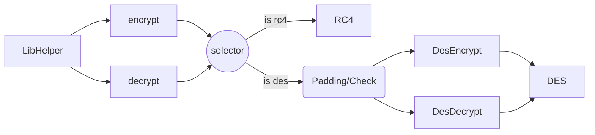
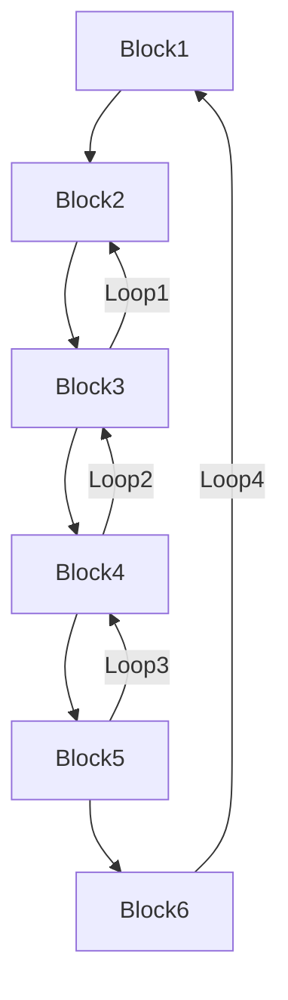
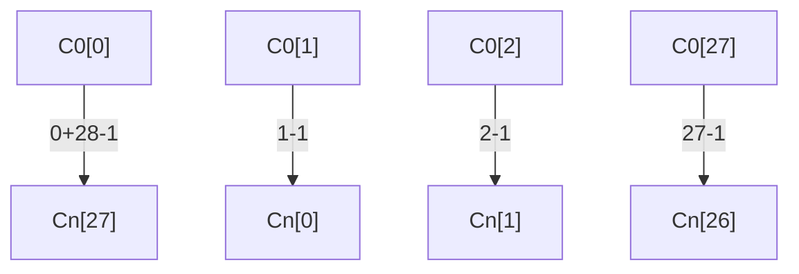

# 介绍

易语言支持库里有个这样的命令：
``` 
〈字节集〉 加密数据 （字节集 字节集数据，文本型 密码文本，［整数型 加密算法］） - 数据操作支持库一->数据加解密 
```
其中加密算法可以选DES以及RC4，使用RC4的话其他软件也可以解密，但是如果使用DES算法，结果却和其他标准算法产生的结果不同。本文详细分析了该不同的原因，以及解决方式。
# 易语言基础

易语言静态编译出的代码在调用库函数时都遵循一个标准：
~~~nasm
push xxxxx  ; 一些标识类型的magic value
push arg    ; 参数
mov ebx, LibFunction ; 支持库的函数指针
call CallLibFunc ; 一个编译器优化后的__cdecl，第一个参数是由ebx传递的函数指针
add esp, 00h ; 调用者清理堆栈
~~~
Call Lib Func函数如下
~~~c
void* CallLibFunc(void* func, int arg_num, ...)
{
    va_start(args, arg_num);
    fun(&ret, arg_num, args);
    return ret;
}
~~~
而易语言内的字节集结构如下
~~~c
struct
{
    int magic; //固定前缀，值为1，具体作用不清楚。
    int len;   //数据长度
    char data[]; //数据，一个长度为len的变长数组
}
~~~
知道了这些，在编译出的程序里很容易就能定位到我们想要的函数的位置。

# 外部装饰

## 开始

首先为了分析该函数的具体实现，首先写一个简单的程序，代码如下：

~~~c++
' 987654321
加密数据 ({ 57, 56, 55, 54, 53, 52, 51, 50, 49, 0 }, “1122334455”, #DES算法)

置入代码 ({ 144, 144, 144, 144, 144, 144, 144, 144 }) ' 方便定位

' 0099887766
解密数据 ({ 48, 48, 57, 57, 56, 56, 55, 55, 54, 54, 0 }, “0022446688”, #DES算法) 
~~~

静态编译后依靠特征码定位出函数后，可以看到编译之后的代码。下面是一个去掉无关代码后的实例：

~~~nasm
; WinMain  proc

; 加密数据
push    80000301h     ; 表示整数型
push    0
push    1             ; 算法类型
push    80000004h     
push    0
push    offset g_key1 ; "1122334455"
push    80000005h
push    0
push    offset g_encrypted_data ; "987654321"
push    3          ; 参数数量
mov     eax, 1
mov     ebx, offset E_EncryptData
call    E_StaticLibCmd
add     esp, 28h
; nop 8

; 解密数据
push    80000301h
push    0
push    1             ; 算法类型
push    80000004h
push    0
push    offset g_key2 ; "0022446688"
push    80000005h
push    0
push    offset g_decrypted_data ; "0099887766"
push    3                ; 参数数量
mov     eax, 1
mov     ebx, offset E_DecryptData
call    E_StaticLibCmd
add     esp, 28h
~~~

算法类型是两个常量：

~~~c
enum
{
    DES_Algorithm    = 1,
    RC4_Algorithm    = 2,
}
~~~

## 包装

根据上面的代码，可以清楚看到需要注意的是`E_EncryptData_DES`以及`E_DecryptData_DES`这两个函数，而这两个函数内部都会调用同一个分发器函数`CryptoSelector`，并且传入参数表示加密或解密。

两个函数的实现：

~~~c
void __cdecl E_EncryptData_DES(char *ret, int arg_num, char *args)
{
    CryptoSelector(ret, args, arg_num, Encryption);
}
~~~

~~~c
void __cdecl E_DeryptData_DES(__int64 *ret, int arg_num, char *args)
{
    CryptoSelector(ret, args, arg_num, Decryption);
}
~~~

类型的定义：

~~~c
enum
{
    Decryption = 0,
    Encryption = 1,
};
~~~

## 分发

由于`加密数据` 支持默认参数，所以`Impl`函数里会首先检测参数数量，如果只有两个则默认调用DES算法。另外，由于`__cdcel`的传参顺序，我们大概可以通过先前`WinMain`里的参数传递确定，`CryptoSelector`第二个参数`args`指向的大概是如下的一个结构：

~~~c
struct
{
    /* arg1 */
    void* data;
    int separator1 = 0;
    int magic1;
    /* arg2 */
    const char* key;
    int separator2 = 0;
    int magic2;
    /* arg3 */
    int algorithm;
    int separator3 = 0;
    int magic3;
}
~~~

下面是一个经过简化的函数实现：

~~~c
int __cdecl CryptoSelector(int *ret, CryptoArgs *args, signed int arg_num, bool encrypt)
{
    data_ptr = args->data->data;
    key = args->key;
    data_len = args->data->len;
    algorithm_type = DES_Algorithm;
    if ( arg_num > 2 && args->magic3 == 0x80000301 && args->algorithm == RC4_Algorithm )
        algorithm_type = RC4_Algorithm;
    
    // 使用rc4算法，rc4的加密和解密算法是相同的
    if ( algorithm_type != DES_Algorithm )
    {
        // 初始化S和T
        InitRc4VectorBox(args->key, strlen(args->key), &rc4_box);
        buffer = malloc(data_len);
        result_ptr = buffer;
        if ( buffer )
        {
            qmemcpy(buffer, data_ptr, data_len);
            result_len = data_len;
            RC4(buffer, data_len, &rc4_box);
        }
        goto MAKE_RESULT;
    }
    
    // DES算法
    if ( !encrypt )
    {
        // DES 解密
        if ( data_len % 8 )                         // DES算法密文一定为8的倍数
            goto MAKE_RESULT;
        buffer = malloc(data_len);
        result_ptr = buffer;
        qmemcpy(buffer, data_ptr, data_len);
        // 解密
        DES_Decrypt(buffer, data_len, key);
    }
    else
    {
        // DES 加密
        // 补位，保证加密后的密文长度为8的倍数+一个size_t的大小
        complement_len = ((_BYTE)data_len - 4) & 7; // x & 7 = x % 8
        if ( complement_len > 0 )
            complement_len = 8 - complement_len;

        result_len = complement_len + data_len + 4;

        buffer = malloc(result_len);
        result_ptr = buffer;
        memset(buffer, 0, result_len);
        *(_DWORD *)buffer = data_len;  // 将长度信息保存在头部
        qmemcpy(buffer + 4, data_ptr, data_len);
        // 加密
        DES_Encrypt(buffer, result_len, key);
    }

    
MAKE_RESULT:
    result = CloneBinData(result_ptr, result_len);
    *ret = result;
    return result;
}
~~~

和之前同样，`DES_Encrypt`和`DES_Decrypt`里也都调用同一个函数，并且通过参数传递加密或解密。

~~~c
int __cdecl DES_Encrypt(char *buffer, int len, char *key)
{
    return DES(buffer, len, key, Encryption);
}
~~~

~~~c
int __cdecl DES_Decrypt(char *buf, int len, char *key)
{
    return DES(buf, len, key, Decryption);
}
~~~

DES的声明：

~~~c
int __cdecl DES(char *buf, int len, char *key, bool encrypt);
~~~


## 总结

流程图：



从图里可以看到，使用一个简单的DES算法竟然需要这么多的中间层，可见易语言的函数调用是非常麻烦的，层层封装导致了代码膨胀和性能问题。

### 测试

到现在为止，虽然DES的`MODE`是什么我们暂时不清楚[^1]，但是明白了秘钥和数据的保存方式[^2]。另外，为了避免补位方式和秘钥大小的问题，只采用64位的秘钥以及64位数据进行测试。

为了方便起见，测试使用Python和`Crypto`算法库。

~~~python
if __name__ == '__main__':
    data_len = '\x04\x00\x00\x00'
    data = data_len + '\x00\x00\x00\x00'
    key = '12345678'
    des = DES.new(key, DES.MODE_ECB)
    print(des.encrypt(data))
    # output: b'\x55\x57\x93\x80\xd7\x71\x38\xef'
~~~
易语言：

~~~
调试输出 (加密数据 ({ 0, 0, 0, 0 }, “12345678”, #DES算法))
' 字节集:8{151,186,138,58,113,5,117,109}
~~~
显然，结果不相同。

[^1]:当然，因为函数没有要求传入IV，所以大几率为ECB模式。
[^2]:事实上，由于不知道内部实现，秘钥和数据的使用方式我们同样不清楚。

# 实现
DES函数内部和普通的实现差不多，首先生成key，然后8位一组循环加密。
~~~c
int __cdecl DES(char *buf, int len, char *key, bool encrypt)
{
    DesUpdateKey(key);                      // 循环xor 将key设置为8bytes长
    DesExpandKey(g_des_key, encrypt == 0);  // 生成子秘钥组
                                            // DES算法加密和解密的区别只有子密钥生成顺序不同
    if ( len / 8 > 0 )
    {
        v6 = len / 8;
        do
    	{	
            result = DesCipherRaw(buf, buf);           // 循环加密8byte block
            buf += 8;
            --v6;
    	}
        while ( v6 );
  	}
    return result;
}
~~~
在`DesUpdateKey`里会对传入的key循环异或，保存在一个全局变量里，在生成子秘钥的时候使用。由于接受的key长度是任意的，该方法确保了可以获得8bytes的key。
~~~c
int* DesUpdateKey(_BYTE* key)
{
    v1 = key;
    g_des_key = 0;
    *(_QWORD *)&g_des_key = 0i64;
    while ( *v1 )
    {
        *result++ = *v1++ ^ *result;
        if ( result == (char *)&g_des_key_end )
            result = (char *)&g_des_key;
    }
    return result;
}
~~~
`DesExpandKey`是生成子秘钥k1-k16的过程，不过有一些编译器的优化，下面是简化后的内容。

## 秘钥置换

### PC-1

这一轮置换很简单，唯一可能复杂一点的可能就是这些位运算。下面`pc1`为置换表1，`bytebit`是获取byte中第n个bit所用的掩码

~~~c
static unsigned short bytebit[8] = {
    0b00000001, 0b00000010, 0b00000100, 0b00001000, 
    0b00010000, 0b00100000, 0b01000000, 0b10000000,
};
static unsigned char pc1[56] = {
    56, 48, 40, 32, 24, 16,  8,  0, 57, 49, 41, 33, 25, 17,
    9,  1, 58, 50, 42, 34, 26, 18, 10,  2, 59, 51, 43, 35,
    62, 54, 46, 38, 30, 22, 14,  6, 61, 53, 45, 37, 29, 21,
    13,  5, 60, 52, 44, 36, 28, 20, 12,  4, 27, 19, 11,  3 
};
~~~
~~~nasm
sub     esp, 0F4h
xor     ecx, ecx
push    ebx
push    ebp
push    esi
mov     esi, [esp+100h+key]
push    edi

pc1:
xor     eax, eax                    
mov     al, pc1[ecx]                ; 获得第i位置换后的位置
mov     edx, eax                    ; 备份
and     eax, 7                      ; pc1[i] mod 8
sar     edx, 3                      ; pc1[i] / 8
mov     bl, byte ptr bytebit[eax*2] ; 掩码表，eas*2是由于bytebit元素大小为int16，但每个元素都不超过int8。编译器将指令优化为了byte，并右移跳过高位0。
mov     dl, [edx+esi]               ; dl = key + edx
test    bl, dl
setnz   al
mov     [esp+ecx+104h+sub_keys], al
inc     ecx
cmp     ecx, 38h ; '8'
jl      short pc1
~~~

之所以`pc1[i] >> 3`以及`and bytesbits[n]`是为了获取第n位的key值。一个简单的内存图如下：

|key[0]|key[1]|key[2]| key[3] | key[4] | key[5] | key[6] |key[7] |
| -------- | ------ | ------ | ------ | ------ | ------ | ------ | ------ |
| 00000000 | 00000000 | 00000000 | 00000000 | 00000000 | 00000000 |00000000|00000000|

首先整除8获取在key中的offset，然后mod 8获取在key[n]中的bit，将结果保存在`sub_keys`对应的位置上。代码很简单，不过上文中的`bytebit`数组依然有几个明显的问题：

1. 明明只需要一个Byte但类型却是short，过大的类型导致在编译后访问时需要`[eax*2]`。
2. 不论BE还是LE系统取第一个bit都应该用`0b10000000`而非`0b00000001`，这个数组是反的。
3. 在置换后将key扩大了，本来56位的key只需7个int8，但置换后一个bit就占了一个字节，需要56个int8。[^3]

[^3]:当然也可能优化了访问速度，空间换时间。

### Ci和Di及Ki生成

先用根据IDA看一下流程图，下面是简化后的图，可以看到是一个大循环里有三个小循环。大循环会循环16次，可以猜出来是在生产k1到k16。


Ki生成一般有三步：
1. 左移C0生成Ci。

2. 左移D0生成Di。

3. 合并Ci、Di，根据PC-2置换。

而C0和D0就是上文提到的`subkeys`的第0-27和28-55位。

**循环左移每轮移动的位数如下：**

|轮数|1|2|3|4|5|6|7|8|9|10|11|12|13|14|15|16|
|-----------------------|-----------------------|-----------------------|-----------------------|-----------------------|-----------------------|-----------------------|-----------------------|-----------------------|-----------------------|-----------------------|-----------------------|-----------------------|-----------------------|-----------------------|-----------------------|-----------------------|
|位数|1|1|2|2|2|2|2|2|1|2|2|2|2|2|2|1|

需要注意的是每一次左移都是在之前的基础上进行的。

#### Loop1/2-生成Ci和Di

循环28次，根据轮数将C0进行循环左移。

```c
static unsigned char shift_table[16] = {1,2,4,6,8,10,12,14,15,17,19,21,23,25,27,28};
// 这是在第n轮左移后数组起始位置的偏移值。
```

```nasm
; ecx = shift_table[i]，i = loop4轮数。
start:
cmp     ecx, 1Ch						; 轮数大于28表示位移起始位置后的移动完毕，接下来需要移动的在sub_keys开头
jge     short case2
case1:
mov     bl, [esp+ecx+104h+sub_keys]		;
jmp     short end

case2:
mov     bl, [esp+ecx+104h+sub_keys-1Ch]	; = subkeys+(0x1C-shift_table[i])

end:
mov     [esp+eax+104h+var], bl			; 保存到另一个本地变量里
inc     eax
inc     ecx								; 移动下一个元素
cmp     eax, 1Ch						; 0x1C=28
jl      short start
```

由于在左移后要将所有左移后位置$i<0$的元素放到数组尾部，所以前后的函数关系为

$$
i_n'(n,i) = \left\{ \begin{array}{}
i-shift[n] & \textrm{if shift$[n]<i$}\\
i+len(key)-shift[n] & \textrm{if shift$[n]>i$}\\
\end{array} \right.
$$

说的好像有点麻烦，画个图直观的看一下吧。当$n=1$时



当然，这里也和pc-1置换一样，让一个bit单独成为了一个byte，可以看到`var`的大小也是$1 \times 56$字节。

#### Loop3-合成Ki

这个过程其实和先前根据PC-1置换秘钥的过程类似，只不过这次是通过位或的形式设置每一位的值，而且共执行$\frac{48}{2}=24$次，而非48次。代码如下：

```c
// 最高为24位，Ki的一半大小。
static unsigned long bytebit2[24] = {
	0x800000L,	0x400000L,	0x200000L,	0x100000L,
	0x80000L,	0x40000L,	0x20000L,	0x10000L,
	0x8000L,	0x4000L,	0x2000L,	0x1000L,
	0x800L,		0x400L,		0x200L,		0x100L,
	0x80L,		0x40L,		0x20L,		0x10L,
	0x8L,		0x4L,		0x2L,		0x1L	
};
// pc2将前28位置换，后28位相互置换，这就是下面代码将pc2分为left和right同时进行的原因。
static unsigned char pc2[48] = {
	13, 16, 10, 23,  0,  4,		 2, 27, 14,  5, 20,  9,
	22, 18, 11,  3, 25,  7, 	15,  6, 26, 19, 12,  1,
	40, 51, 30, 36, 46, 54,		29, 39, 50, 44, 32, 47,
	43, 48, 38, 55, 33, 52, 	45, 41, 49, 35, 28, 31 
};
```

```nasm
; var是前面保存的Cn和Dn
xor     ecx, ecx
mov     eax, offset bytebit2	; 掩码
start:
xor     ebx, ebx
mov     bl, pc2_l[ecx]			; 前24位的pc-2

check_left:
cmp     [esp+ebx+104h+var], 0	; 判断第pc2_l[i]位
jz      short check_right
set_ki_left:
mov     esi, [eax]
mov     ebx, [ebp]
or      ebx, esi				; 通过or将目标位 置1 
mov     [ebp+0], ebx

check_right:
xor     ebx, ebx
mov     bl, pc2_r[ecx]			; 后24位的pc-2
cmp     [esp+ebx+104h+var], 0
jz      short tail
set_ki_right:
mov     esi, [eax]
mov     ebx, [edi]
or      ebx, esi
mov     [edi], ebx

tail:
add     eax, 4					; add 4是因为int32大小为4byte
inc     ecx
cmp     eax, offset pc1
jl      short start
```

#### Loop4-保存Ki

这里做的事情其实只有一个，即保存产生的Ki。而由于Ki是48位，即6个int8大小，为了内存对齐所以直接保存为了一个2个int32。

另外，这个循环的条件也有点奇怪：

```nasm
before_loop:
mov     eax, 1Eh				; 30
mov     [esp+104h+var_F4], eax

loop_tail:
mov     eax, [esp+104h+var_F4]
sub     eax, 2
cmp     eax, 0FFFFFFFEh
mov     [esp+104h+var_F4], eax
jg      start
```

这里之所以和-2比较是因为30正好是`Kn`数组最后一个元素的偏移，用30可以节约资源。

最后，目前`Kn`是保存在局部变量中的，所以在`DesExpandKey`函数最后会调用一个函数将其保存在全局静态变量中。保存时也同样有一堆位运算，作用是将原先`Kn`中字节中的0值压缩掉，下面是逆向后的C代码：

```c
void CleanKn(unsigned int* k){
	for ( i = 0; i < 16; i++, k++ ) {
		v1 = k++;
		*v2	 = (*v1 & 0x00fc0000L) << 6;
		*v2	|= (*v1 & 0x00000fc0L) << 10;
		*v2	|= (*k & 0x00fc0000L) >> 10;
		*v2++	|= (*k & 0x00000fc0L) >> 6;
		*v2	 = (*v1 & 0x0003f000L) << 12;
		*v2	|= (*v1 & 0x0000003fL) << 16;
		*v2	|= (*k & 0x0003f000L) >> 4;
		*v2++	|= (*k & 0x0000003fL);
	}
    memcpy(g_des_key, v2, 2*sizeof(int)*16); //大小是和原先一样的，只不过中间没有空隙了
}
```

#### 解密

DES中，解密和加密唯一的不同就是`Kn`的产生顺序，而在程序中，如果是解密会将`Kn`从后向前保存，其他代码没有区别。

```nasm
cmp     [esp+104h+decrypt], 1
jz      short decrypt
encrypt:
lea     eax, [edx+edx]					; 从0开始

decrypt:
lea     edi, [esp+eax*4+104h+var_80+4]	; 从31开始
lea     ebp, [esp+eax*4+104h+var_80]
```

### 测试

DES算法虽然产生秘钥时很繁琐，但是具体思路其实很清楚。而上面的实现除去一些优化的部分外，也是一个典型的DES算法。当然，在PC-1置换时出现了一个错误，导致每一个Key值都的每一个Byte都被按位倒转了，这可能就是该算法和其余算法结果不同的原因。为了测试，传入一个位值是回文的Key[^4]，加密结果如下：

```python
# Python
data_len = '\x04\x00\x00\x00'
data = data_len + '\x00\x00\x00\x00'
key = 'ffffffff'
des = DES.new(key, DES.MODE_ECB)
print([str(b) for b in des.encrypt(data)])
# 结果：
# ['199', '106', '231', '43', '91', '140', '255', '77']

# 易语言:
# 调试输出 (加密数据 ({ 0, 0, 0, 0 }, “ffffffff”, ))
# 结果:
# * 字节集:8{199,106,231,43,91,140,255,77}
```
结果一致，可见不同的结果是由在PC-1置换中的错误导致的。

[^4]: 一个可能的值为'f'(0110 0110)

## 加密块

TODO

# 总结
关于这个问题到底是一个feature还是BUG，我不能确定，也不知道去哪提交。

不过避免这个问题的方法也很简单，在调用"加/解密数据"或者其他DES函数时将key同样按照上面的方式倒转一次就可以了。

下面是一个简单的python实现，其他语言同理
~~~python
from Crypto.Cipher import DES
import struct

def reverse_bytes(b):
    assert type(b) == bytes
    ba = bytearray(b)
    for i in range(0, len(b)):
        ba[i] = int(format(b[i], '0>8b')[::-1], 2)
    return bytes(ba)


def get_new_key(key):
    ba = bytearray(8)
    i = 0
    for b in key:
        ba[i] = b ^ ba[i]
        i = i + 1 if i < 8 else 0
    return bytes(ba)


# zero padding
def padding(d):
    ba = bytearray(d)
    while len(ba) % 8 != 0:
        ba.append(0)

    return bytes(ba)


def append_len(d):
    assert type(d) == bytes
    length = struct.pack('<L', len(d))

    return bytes(length + d)


def remove_len(d):
    assert type(d) == bytes
    return d[4:]


def e_des_encrypt(plain, key):
    des = DES.new(reverse_bytes(get_new_key(key)), DES.MODE_ECB)
    return des.encrypt(padding(append_len(plain)))


def e_des_decrypt(raw, key):
    des = DES.new(reverse_bytes(get_new_key(key)), DES.MODE_ECB)
    t = des.decrypt(raw)
    return remove_len(t)
~~~
经测试与易语言的加密数据命令输出结果相同。
~~~python
  # 易语言：
  # 输出调试文本(字节集_字节集到十六进制 (加密数据 (到字节集 (“123456789”), “123456789”, #DES算法)))
  # 输出：
  # 53DEE70DD231541839EB99553B8B056D
  # --------------------------------
  # python:
  plain = b'123456789'
  key = b'123456789'
  ciph = e_des_encrypt(plain, key)

  print(ciph.hex().upper())
  print(e_des_decrypt(ciph, key).decode())
  # 输出:
  # 53DEE70DD231541839EB99553B8B056D123456789
  # 123456789
~~~

# 参考资料

1. [一篇关于DES算法的简单介绍](https://blog.csdn.net/lisonglisonglisong/article/details/41777413)